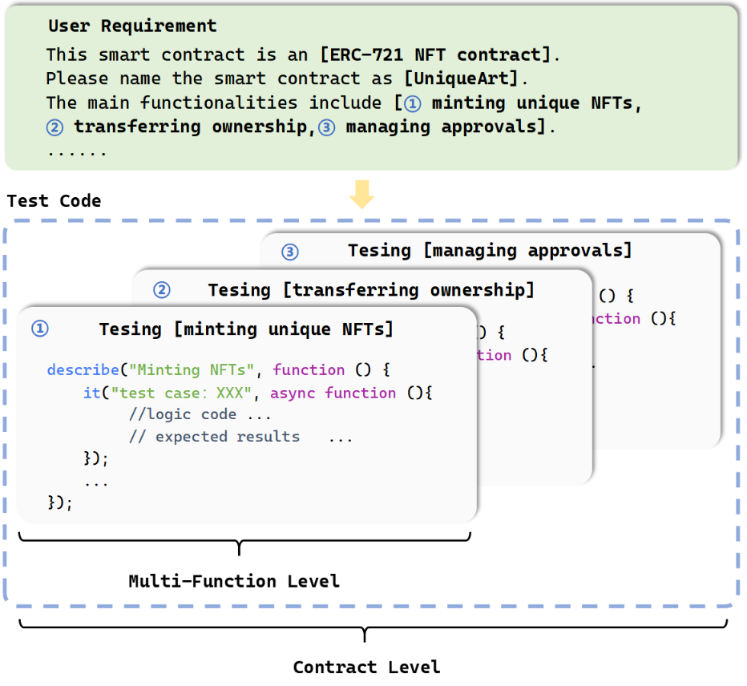

# FSM-SCG
FSM-SCG: Guiding Large Language Models with Finite State Machine for Smart Contract Generation

## Framework

## Datasets
### Fine-Tuning Dataset
The model of this framework is fine-tuned on the **Smart Contract Multi-Task Dataset** for smart contract generation. Access the dataset here:
[Smart Contract Multi-Task Dataset](https://huggingface.co/datasets/lohoz/Smart-Contract-MultiTask-Dataset)

### Benchmark
The correctness of generated smart contracts is tested using our own benchmark dataset. Access the dataset here:
[Smart Contract Benchmark](https://huggingface.co/datasets/lohoz/Smart-Contract-Benchmark)

